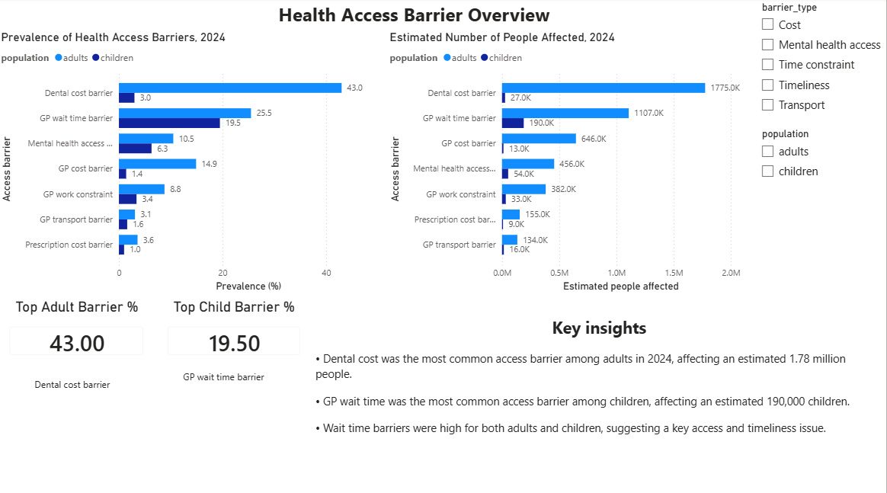
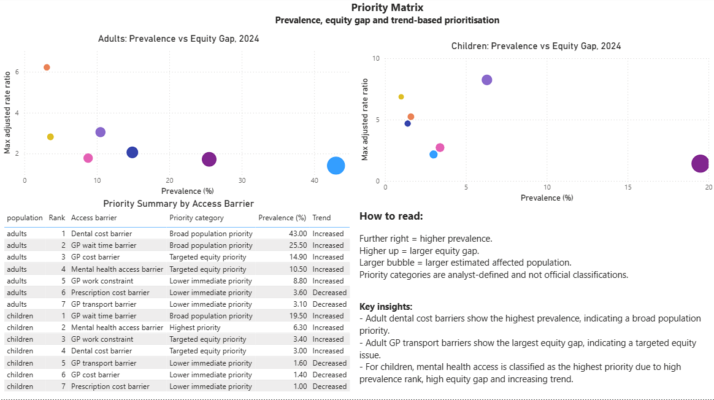
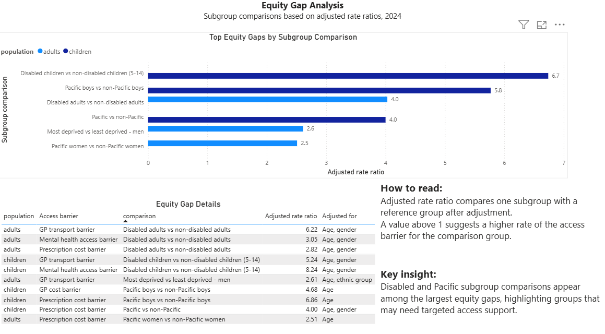
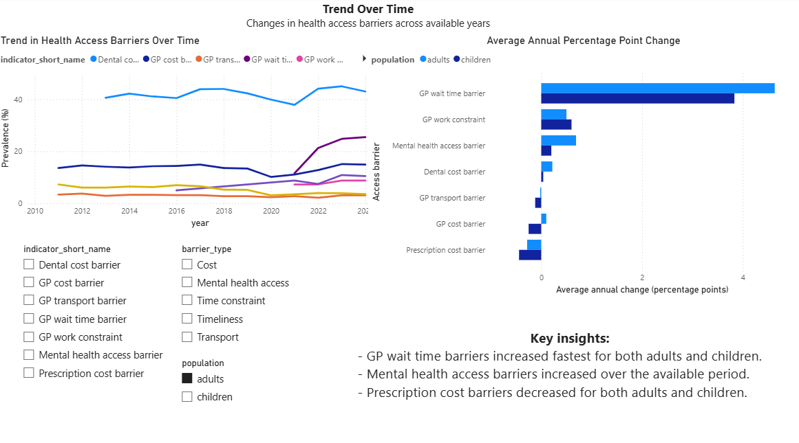

# New Zealand Health Access & Equity Reporting Dashboard

## Project Overview

This project analyses health service access barriers in New Zealand using New Zealand Health Survey data.

The dashboard identifies which health access barriers are most common, which barriers affect the largest estimated populations, where subgroup equity gaps are largest, and which barriers are increasing or decreasing over time.

The project is designed as a population health reporting and service planning analytics project. It does not analyse hospital operations or patient-level clinical records.
## Dashboard Preview

The final Power BI dashboard contains four pages covering access barrier prevalence, priority areas, equity gaps and trend changes.

### Access Barrier Overview



### Priority Matrix


## Key Questions

This project aims to answer:

1. Which health access barriers are most common among adults and children?
2. Which barriers affect the largest estimated number of people?
3. Which population groups experience larger access gaps?
4. Are selected access barriers increasing or decreasing over time?
5. Which issues may be prioritised based on prevalence, equity gap and trend?

## Data Source

The project uses publicly available New Zealand Health Survey data from the Ministry of Health.

Three raw datasets were used:

- `prevalence_mean.csv`
- `subgroup_comparison.csv`
- `changes_over_time.csv`

The analysis focuses on selected health access indicators related to unmet need for healthcare services.

## Selected Indicators

Seven health access indicators were selected:

1. Unfilled prescription due to cost
2. Unmet need for GP due to cost
3. Unmet need for GP due to transport
4. Unmet need for GP due to wait time
5. Unmet need for GP due to work
6. Unmet need for dental health care due to cost
7. Unmet need for mental health care and addictions services

These indicators were selected because they all represent situations where people had a healthcare need but did not receive care because of an access barrier.

## Tools Used

- Python
- Pandas
- PostgreSQL
- SQL
- Power BI
- Jupyter Notebook

## Project Workflow

The project follows a reporting pipeline:

```text
Raw CSV files
→ Data profiling
→ Indicator mapping
→ Data cleaning and standardisation
→ Processed reporting tables
→ PostgreSQL database
→ SQL reporting views
→ Power BI dashboard
```

## Folder Structure

```text
NZ-health-access-equity-dashboard/
│
├── README.md
├── .gitignore
│
├── config/
│   └── indicator_mapping.csv
│
├── data/
│   ├── raw/
│   │   ├── changes_over_time.csv
│   │   ├── prevalence_mean.csv
│   │   └── subgroup_comparison.csv
│   │
│   ├── processed/
│   │   ├── dim_indicator.csv
│   │   ├── dim_population_group.csv
│   │   ├── fact_prevalence.csv
│   │   ├── fact_subgroup_comparison.csv
│   │   └── fact_trend.csv
│   │
│   └── powerbi/
│       ├── fact_trend.csv
│       ├── vw_equity_gap.csv
│       ├── vw_latest_prevalence.csv
│       ├── vw_priority_barriers.csv
│       ├── vw_priority_matrix.csv
│       └── vw_trend_summary.csv
│
├── notebooks/
│   ├── 01_data_profiling.ipynb
│   ├── 02_data_cleaning.ipynb
│   ├── 03_postgresql_load.ipynb
│   └── 04_dashboard_design.ipynb
│
├── outputs/
│   └── screenshots/
│       ├── 01_access_barrier_overview.png
│       ├── 02_priority_matrix.png
│       ├── 03_equity_gap_analysis.png
│       └── 04_trend_over_time.png
│
└── powerbi/
    └── Health_Access_Equity_Dashboard.pbix
```

## Data Model

The cleaned data was structured into fact and dimension tables.

### Fact Tables

- `fact_prevalence`: prevalence values, confidence intervals and estimated affected population
- `fact_subgroup_comparison`: subgroup comparisons and adjusted rate ratios
- `fact_trend`: year-by-year trend values in long format

### Dimension Tables

- `dim_indicator`: indicator names, short names, themes and barrier types
- `dim_population_group`: population and group categories used for reporting

## PostgreSQL Reporting Views

The following SQL views were created for dashboard reporting:

| View | Purpose |
|---|---|
| `vw_latest_prevalence` | Latest total-group prevalence and estimated affected population |
| `vw_priority_barriers` | Ranking of barriers by prevalence and estimated affected population |
| `vw_equity_gap` | Subgroup equity gap analysis using adjusted rate ratios |
| `vw_trend_summary` | Start-to-end trend comparison and average annual change |
| `vw_priority_matrix` | Combined prevalence, equity gap and trend-based priority categorisation |

## Priority Matrix Logic

The priority matrix combines three dimensions:

1. Latest prevalence ranking
2. Largest available subgroup equity gap
3. Trend direction and average annual percentage point change

Priority categories are analyst-defined and used for exploratory reporting and service planning. They are not official Ministry of Health classifications.

Example categories include:

- Highest priority
- Broad population priority
- Targeted equity priority
- Lower immediate priority

## Dashboard Pages

### 1. Access Barrier Overview

This page shows the latest prevalence and estimated affected population for selected access barriers.


Key findings:

- Dental cost was the most common access barrier among adults in 2024.
- GP wait time was the most common access barrier among children in 2024.
- Wait time barriers were high for both adults and children.

---

### 2. Priority Matrix

This page combines prevalence, equity gap and trend information to support priority setting.


Key findings:

- Adult dental cost barriers showed the highest prevalence and were classified as a broad population priority.
- Adult GP transport barriers showed a large equity gap and were identified as a targeted equity issue.
- For children, mental health access was classified as the highest priority based on high prevalence rank, high equity gap and increasing trend.

---

### 3. Equity Gap Analysis

This page shows subgroup comparisons with the largest adjusted rate ratios.



Key findings:

- Disabled and Pacific subgroup comparisons appeared among the largest equity gaps.
- Adjusted rate ratios above 1 suggest the comparison group had a higher rate of the access barrier than the reference group.
- These results suggest areas where targeted access support may be needed.

---

### 4. Trend Over Time

This page shows how selected health access barriers changed across available years.



Key findings:

- GP wait time barriers increased fastest for both adults and children.
- Mental health access barriers increased over the available period.
- Prescription cost barriers decreased for both adults and children.

## Key Analytical Notes

- This project identifies access barriers and equity gaps at a population level.
- The analysis does not prove causation.
- Trend comparisons are based on available years, and some indicators have different starting years.
- Priority categories are analyst-defined and should be interpreted as exploratory reporting outputs.

## Skills Demonstrated

- Data profiling and indicator selection
- Data cleaning and standardisation with Python
- Reporting table design
- PostgreSQL loading and validation
- SQL view creation
- Power BI dashboard design
- Population health and equity-focused reporting
- Translating data outputs into service planning insights

## Example Project Summary

Built a health access equity reporting project using New Zealand Health Survey data, Python, PostgreSQL and Power BI to identify unmet healthcare needs, priority barriers, subgroup equity gaps and trend changes across adults and children.

## Limitations

This project uses publicly available survey data and should be interpreted as population-level reporting. It does not use patient-level clinical records, hospital operational data or real-time service delivery data.

The dashboard supports exploratory analysis and service planning discussions, but it does not establish causal relationships between population characteristics and access barriers.
